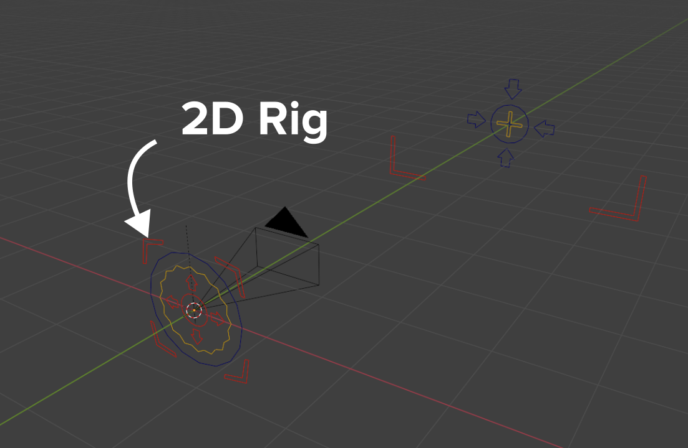

# Add Camera Rigs

This add-on extends the functionality of a camera by creating control rigs with widgets and adds a panel to quickly access the camera’s settings from the 3D Viewport.

## Video demo

## Activation
Open Blender and go to Preferences then the Get Extensions tab.

Search for **Add Camera Rigs** and then click the **install** button.

## Description
After activating the add-on, it will place three menu items in the Add ‣ Camera menu. They are Dolly Rig, Crane Rig and 2D Camera Rig.

The first two rigs are very similar except the “Crane Rig” has two extra adjustable bones (Arm Height and Arm Length) to make it easier to achieve a cinematic crane shot.

The 2D Camera Rig is mostly useful for 2D shots, when the camera is static and the action happens in front of it (like a theater stage).

## Usage
Add a Add ‣ Camera ‣ Dolly Camera Rig, Crane Camera Rig or 2D Camera Rig. This will build the rig at the cursor location, add a new camera, making it the new active scene camera.  

When the Rig is selected, the camera properties will be displayed in the Sidebar.

# 3D Rigs (Dolly & Crane)
These rigs are designed to make it easier to achieve the motion of a real world dolly camrea rig and crane camera rig.  They have a similar set up, however, the Crane Rig has 2 extra controls for the height and the length of the crane arm. This arm makes it easier to achieve the arcing motion of the real life crane rig.  

## Controls
### Root
This is the parent of the entire rig.  Move this around in 3d space to control all the components at once.

### Camera
This is the control that will translate the camera around. By default it will track to the aim control.

### Camera_Offset
This is a child of the Camera control.  It is a secondary control to enable extra rotation or translation of the actualy camrea without affecting the main control.

### Aim 
The camera will point at this control. You can also tilt the camera by rotating the Aim on its Y axis.

### Crane_Height (Crane Rig Only)
This control is designed to raise and lower the height of the rig from the Root control.  You can scale the control or use the slider in the UI to adjust the height setting. It can also be animated if you wish.

### Crane_Arm (Crane Rig Only)
This control is designed to increase or decrease the length of the crane boom arm.  This makes it easier to achieve arcing motion just like a real crane camera rig.  You can scale the control or use the slider in the UI to adjust this setting. It can also be animated if you wish.

# 2D Rig
This rig is designed to provide fine controls over the framing while aiming at one direction. With it, you can frame the action by moving two of the corners of the camera, instead of moving and rotating it. It produces smooth movements that would be hard to achieve without it, by using complex drivers to calculate the appropriate camera settings.

### Root and Noise
Root is the parent of the entire rig. It is the only bone that you should rotate to aim approximately at the action. Root_Offset and Root_Tweak provide additional levels of parenting and can be used as offsets or to add a shake to the camera.

### Left_corner and Right_corner
These are the most important bones in this rig. You can move them to quickly set and animate a framing. The camera will adjust its parameters to adapt to this framing (focal length, rotation / shift). They should always be at the same height (Y axis in the camera’s coordinate system).

### Aim
This control provides a convenient way to move both corners at once, to make sure a pan does not change the zoom.

### Camera
You can move the camera around, and it will compensate its settings to frame the two corners. For instance, if you leave the corners fixed on both sides of the subject and move the camera forward, you will achieve an efficient dolly zoom effect.

Rotation is the default mode, and will rotate the camera to aim at and keep the corners in its frame. Shift mode, on the other hand, uses the Shift properties on the Camera to achieve a cropping effect instead of a pan.

### 2d Rig Limitations
 - When moving the corners too far to the side in rotation mode, perspective makes the rig much less accurate.

 - Rotation mode is unsupported for orthographic cameras.

# Interface
## Widgets
When a rig is built, the add-on will create a collection for all the custom bone shapes (named Widgets). By default when the widgets are built they will use the prefix "WGT-". If you have more than one rig in the scene, it will use the same widgets in the same collection rather than duplicating them. The default collection name and the widget prefix can be set in the preferences of the add-on. (This will not change the name of any existing widgets or collection, only ones that are created after you change the setting.)

### Mode:
All Modes

### UI Panel:
3D Viewport ‣ Sidebar ‣ Item ‣ Camera Rig

The UI panel will display the most used camera settings. Only the added features will be explain here, for more information refer to the Cameras section.  
#### Dolly Rig UI

#### 2d Rig UI

### Set DOF to Aim
The Set DOF to Aim button will automatically set up the camera so that it uses the camera rig’s Aim control as a target for the depth of field (DOF).

### Set Dolly Zoom
When you enable this operator, the Aim control will be linked to the focal length.  This makes it very easy to achieve the classic Dolly Zoom effect.

The Aim bone will turn red to give visual feedback that Dolly Zoom mode is active.  There is a further offset value that can be animated if you wish, and when you turn this mode off, it will keep the current focal length.

 ### Shift To Pivot
 This operator will shift the Camera and Aim controls directly over the top of the Root control while maintaining their current distance from each other.  This is useful if you want to use the rig for a turnaround shot.

 ### Swap Lens
 When you activate the Swap Lens feature you can set the focal length of the camera and it will adjust the camera position to maintain the same framing.  This is useful, for example when you have set up your camera framing on a 50mm lens but you then you need to change it to 70mm.  Normally you would have to change the lens and then reposition the camera, however this operator will do that for you.

### Focal Distance/F-Stop/Focal Length
These are custom properties on the camera control bone that drive the equivalent setting on the actual camera. This makes it animatable inside the armature object rather than having to animate the armature and the camera.

### Show in Front
Will make the rig object visible through all other geometry. (Useful if you have a fly through scene or if other meshes are in the way.)

### Lock Camera Select
The Lock Camera Select is a toggle button to make the camera unselectable (so you can’t accidentally delete it).

### Tracking (Aim Lock)
This slider controls the Track To constraint on the control bone. Turn it off and the bone will not point to the aim bone anymore.

### Crane Rig Height, Arm Length
The Arm Height and Arm Length sliders at the bottom of the UI show the Y axis scale of the relevant bone. By default, both the height and the arm length are at 1 unit in size. These values only show in the interface when a crane rig is selected, they are also animatable.

### Rotation/Shift
The Rotation/Shift slider lets you switch between Rotation and Shift modes for the 2D Camera rig. You can also choose an intermediate value to have a bit of both.

## Multiple Cameras
It is possible to add as many rigs as your scene needs. The Make Camera Active will appear if the camera attached to the selected rig is not the active camera. By pressing this, it will make this camera the active one.

## Camera Switching
If you wish to switch cameras during an animation, you can do this with the Add Marker and Bind button. This uses Blender’s built-in camera binding tool to a Timeline marker. When pressed, it will add a marker to the Timeline and bind it to the camera controlled by the selected rig. Go to another frame, select a different camera rig and press it again. Now you have two markers and when you scrub the Timeline you will see the active camera switch accordingly. (Repeat this process as many times as needed). These markers can then also be dragged around in the Timeline to change the frame at which they will switch.

## Troubleshooting
If the Aim tracking or 2D rig are not functioning, check that you have “Auto Run Python Scripts” enabled in the Preferences Preferences ‣ Save & Load ‣ Auto Run Python Scripts.

### See also:  
A [blog post](https://lacuisine.tech/2d-camera-rig/) explaining the 2D rig by its authors.
